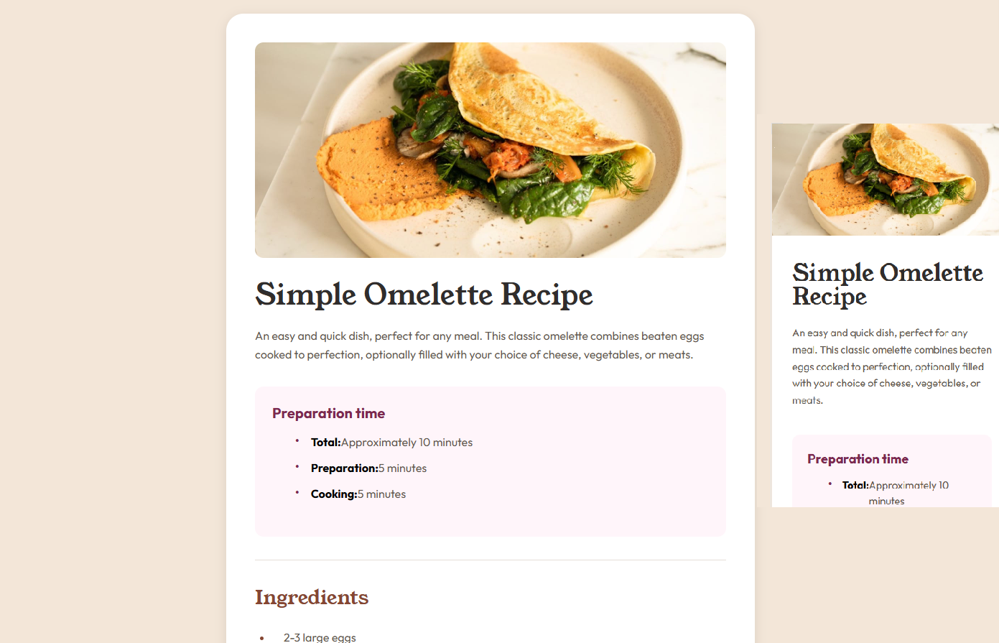

# Frontend Mentor - Recipe page solution

This is a solution to the [Recipe page challenge on Frontend Mentor](https://www.frontendmentor.io/challenges/recipe-page-KiTsR8QQKm). Frontend Mentor challenges help you improve your coding skills by building realistic projects.

## Table of contents

- [Overview](#overview)
  - [The challenge](#the-challenge)
  - [Screenshot](#screenshot)
- [My process](#my-process)
  - [Built with](#built-with)
  - [What I learned](#what-i-learned)
  - [Continued development](#continued-development)
  - [Useful resources](#useful-resources)
  - [AI Collaboration](#ai-collaboration)
- [Author](#author)
- [Acknowledgments](#acknowledgments)

## Overview

### The challenge

Your challenge is to build out this recipe page and get it looking as close to the design as possible.

You can use any tools you like to help you complete the challenge. So if you've got something you'd like to practice, feel free to give it a go.

### Screenshot



Add a screenshot of your solution. The easiest way to do this is to use Firefox to view your project, right-click the page and select "Take a Screenshot". You can choose either a full-height screenshot or a cropped one based on how long the page is. If it's very long, it might be best to crop it.

Alternatively, you can use a tool like [FireShot](https://getfireshot.com/) to take the screenshot. FireShot has a free option, so you don't need to purchase it.

Then crop/optimize/edit your image however you like, add it to your project, and update the file path in the image above.


## My process

### Built with

- Semantic HTML5 markup
- CSS custom properties
- Flexbox
- Mobile-first workflow

### What I learned

In this project, I learned the importance of structuring content with semantic HTML and using CSS for responsive design. By focusing on mobile-first approach, I ensured the page looks great on all devices.

```html
<h1>Recipe Title</h1>
```
```css
.recipe-container {
  display: flex;
  flex-direction: column;
}
```

This approach helped me create a clean and accessible layout.

### Continued development

I want to continue focusing on responsive design techniques and accessibility features in future projects. Additionally, exploring CSS Grid for more complex layouts would be beneficial.

### Useful resources

- [MDN Web Docs on Flexbox](https://developer.mozilla.org/en-US/docs/Learn/CSS/CSS_layout/Flexbox) - Helped me understand flexbox layout.
- [Frontend Mentor Community](https://www.frontendmentor.io/community) - Great for getting feedback and inspiration from other developers.

### AI Collaboration

I used GitHub Copilot to assist with generating CSS classes and HTML structure, making the development process faster and more efficient.

## Author

- Frontend Mentor - [@AlexanderMartinez0410](https://www.frontendmentor.io/profile/AlexanderMartinez0410)

## Acknowledgments

Thanks to Frontend Mentor for providing this challenge, which helped me practice my HTML and CSS skills.
